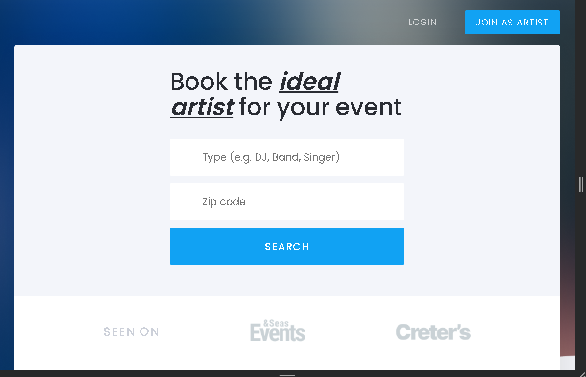

### Artisto

Artisto is a platform where users can easily book their ideal artist for events. This project was created as a part of learning HTML and CSS, with a focus on building a responsive web application that works seamlessly across various devices, including desktops, tablets, and mobile phones.

#### Features

- **Search Functionality**: Users can search for artists based on their preferences, such as the type of artist (e.g., DJ, Band, Singer) and location (zip code).

- **Artist Booking**: Once users find their desired artist, they can easily book and pay for their services through the platform.

- **How it Works Section**: A user-friendly guide explains the process of finding, booking, and enjoying the services of an artist.

#### Preview

**Web Demo:**

**Tablet Demo:**

**Mobile Demo:**

#### Usage

1. Clone the repository: `git clone <repository-url>`
2. Open the `index.html` file in your web browser.

#### Contributing

Contributions are welcome! If you find any bugs or have suggestions for improvements, feel free to open an issue or submit a pull request.

#### License

This project is licensed under the MIT License - see the [LICENSE](LICENSE) file for details.

---

*© 2025 ArtistFinder. This project was created with a passion for learning web development and building a platform to connect users with their favorite artists for events.*